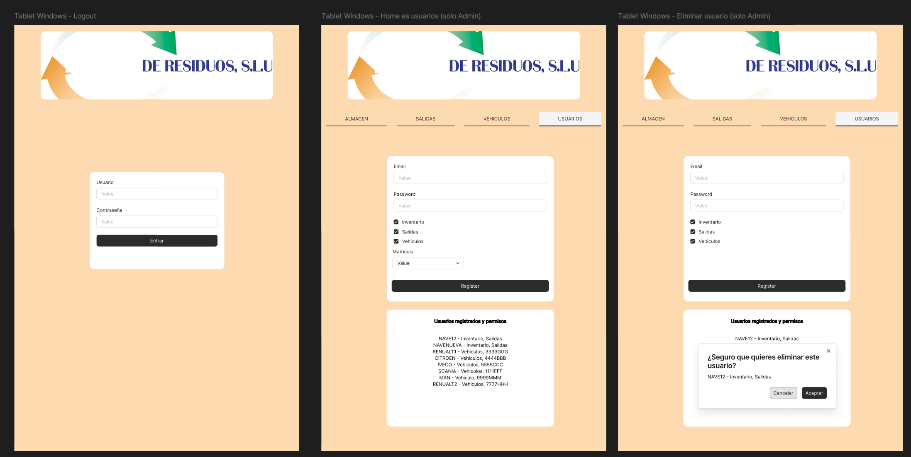
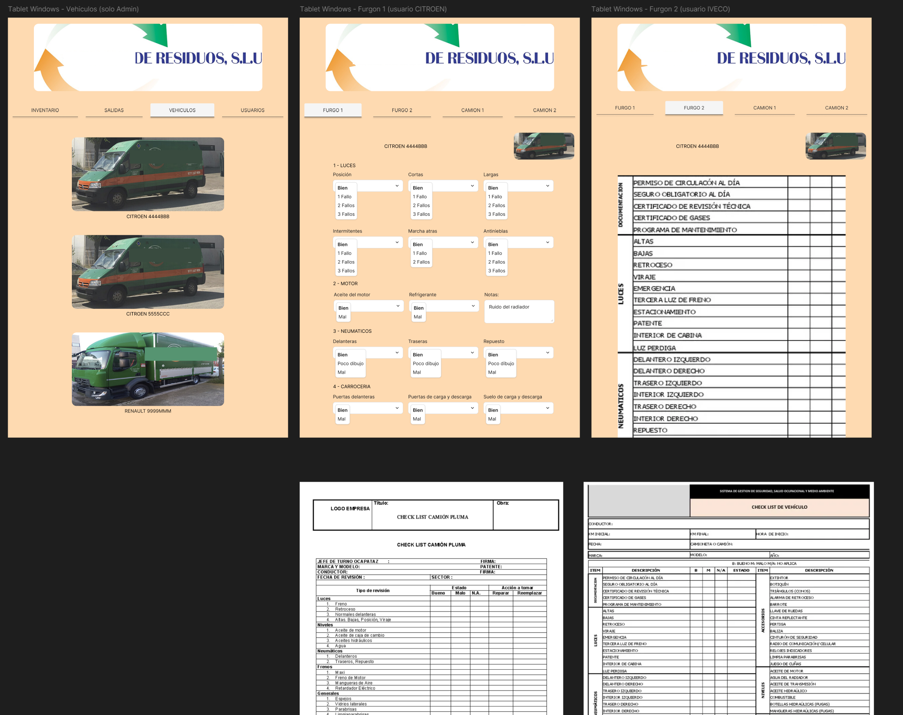

# DEMO - CDR

Custom applications are tools designed specifically to meet the particular needs of a company. These applications can offer a wide range of benefits that can improve efficiency, productivity and competitiveness. Some of the main reasons why they are useful: Adaptation to Specific NEEDS, INTEGRATION with Existing Systems, Improvement of Operational EFFICIENCY, SECURITY and Data Collection and Analysis.

# Registration and list of Users

## User Cases

### Administrator

- Create user (name, password and assign section)
- Delete user
- Access and use of all sections

### User

- Access and use of the assigned section

# Warehouse and Inventory

The inventory will be a detailed record of the waste that the company stores, and is essential for the efficient management of resources. 

Here are some key reasons why it is necessary to maintain an inventory: real stock control, optimize resources, avoid accidents and help in planning and decision making.

## Store

Only the user assigned to this section will be able to access it (warehouse: inventory, stagnant, data and search).

### Inventory

The user will be able to register the waste:

    - LER: European Waste list drop-down and filter.
    - Conditioning or stored in: GRG, Pallet, Big Bag, Drums of 200 or smaller size.
    - Weight: indicated in kilograms.
    - Stagnant: mark when the waste is stored (minimum one month) for a long period.

In the inventory the user will be able to see the registered waste where they will be grouped by LER and differentiated by their packaging and indicating their weight in kg.

### Stagnant

Users can consult which waste is stored (minimum one month) for an extended period.

### Data

Workers can consult a summary of the data recorded in inventory:
    - Horizontal graph
    - Total amount in kg per LER (residue)

### Search

The user can search for all waste registered with a specific LER:
    - Enter an LER in the search engine
    - Delete an inserted record

# Trailer Departures and Loads

Preparing a truck load list is essential for several reasons, both logistical, safety and operational efficiency. some of the most important reasons: optimize space, safety or avoid accidents, monitoring or traceability and help in planning and decision making.

## Departures

Only the user assigned to this section will be able to access it (outputs: trailer1, trailer2, trailer3 and search)

### Trailer 1,2 and 3

The user will be able to make a record of the waste that will be loaded into the trailer, and will be able to indicate:

    - LER: European Waste list drop-down and filter.
    - Waste packaging: GRG, Pallet, Big Bag, Drums of 200 or smaller size.
    - Weight: indicated in kilograms.

### Search

The user can search for all waste registered to load on trailers with a specific LER:
    - Enter an LER in the search engine
    - Delete an inserted record
    - It will be shown differentiated by TRAILER1-3

# Vehicle and Maintenance

Tracking vehicle health is crucial for several reasons spanning safety, operational performance, economics and regulatory compliance. Some of the reasons that justify doing so: everyone's safety, optimizing use and avoiding downtime, economic, complying with laws, for the environment and helping in planning and decision-making.

# Vehicles

Only the user assigned to this section will be able to access a specific vehicle (van1, van2, truck1, truck2, truck3, truck4 and search).

### Van1 (example)

The user will be able to track or review the status of the assigned vehicle, using a checklist or a form.

Parts to monitor or review:
    - Documentation
    - Lights
    - Engine
    - Brake
    - Tires
    - Transmission
    - Driver's area
    - Cargo area
    - Bodywork
    - Basic accessories
    - ADR accessories

